# Smart Ping: Architecture and Components

## 1. Architectural Overview

Smart Ping follows a modern web application architecture with clear separation of concerns between frontend, backend, and data layers. This document provides a detailed analysis of the system's architecture and component interactions.

### 1.1 High-Level Architecture

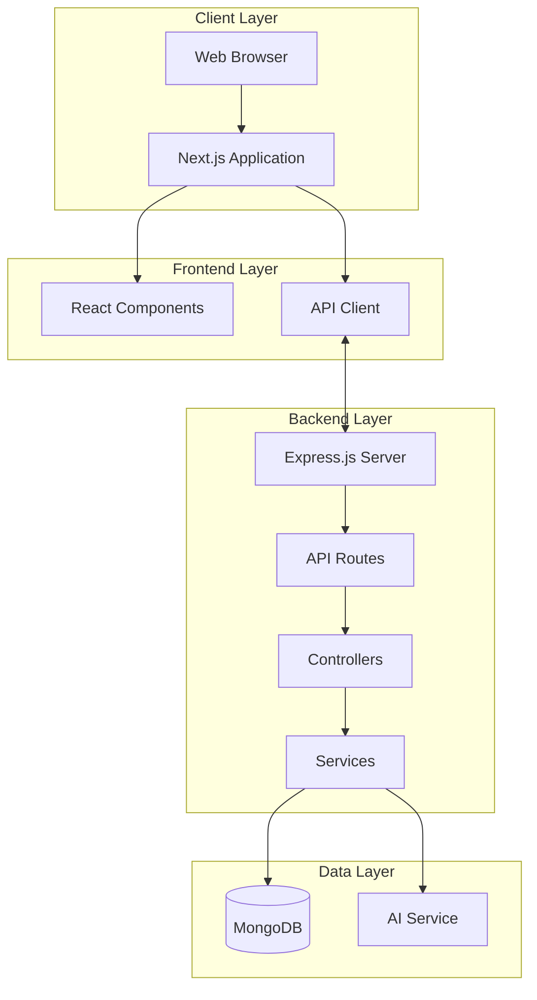

### 1.2 Architectural Patterns

Smart Ping implements several architectural patterns:

1. **Client-Server Architecture**: Clear separation between client (browser) and server (Express.js)
2. **Single Page Application (SPA)**: React/Next.js frontend with client-side routing
3. **RESTful API**: HTTP-based API following REST principles
4. **Model-View-Controller (MVC)**: Separation of data models, view components, and controllers
5. **Repository Pattern**: Abstraction layer for data access operations

## 2. Component Breakdown

### 2.1 Frontend Components

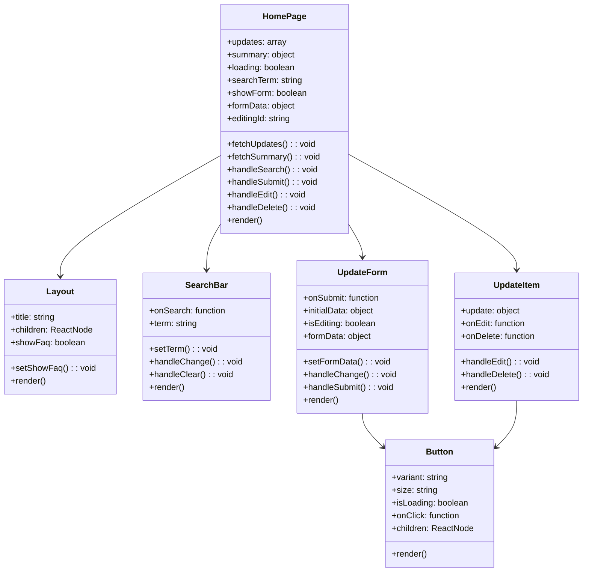

#### Component Responsibilities

| Component | Primary Responsibility | Key Features |
|-----------|------------------------|---------------|
| Layout | Page structure and navigation | Header, footer, FAQ modal, responsive design |
| SearchBar | Search functionality | Debounced input, clear button, search icon |
| UpdateForm | Create/edit updates | Form validation, dynamic editing mode |
| UpdateItem | Display individual updates | Edit/delete actions, formatted display |
| Button | Reusable button component | Multiple variants, sizes, loading state |
| HomePage | Main page orchestration | State management, API integration |

### 2.2 Backend Components

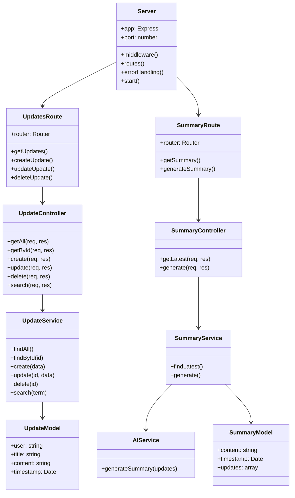

#### Component Responsibilities

| Component | Primary Responsibility | Key Features |
|-----------|------------------------|---------------|
| Server | Application bootstrap | Middleware setup, route registration, error handling |
| Routes | API endpoint definition | HTTP method handlers, parameter validation |
| Controllers | Request handling | Input processing, service coordination, response formatting |
| Services | Business logic | Data manipulation, external service integration |
| Models | Data structure | Schema definition, validation rules |

## 3. Data Flow Analysis

### 3.1 Create Update Flow

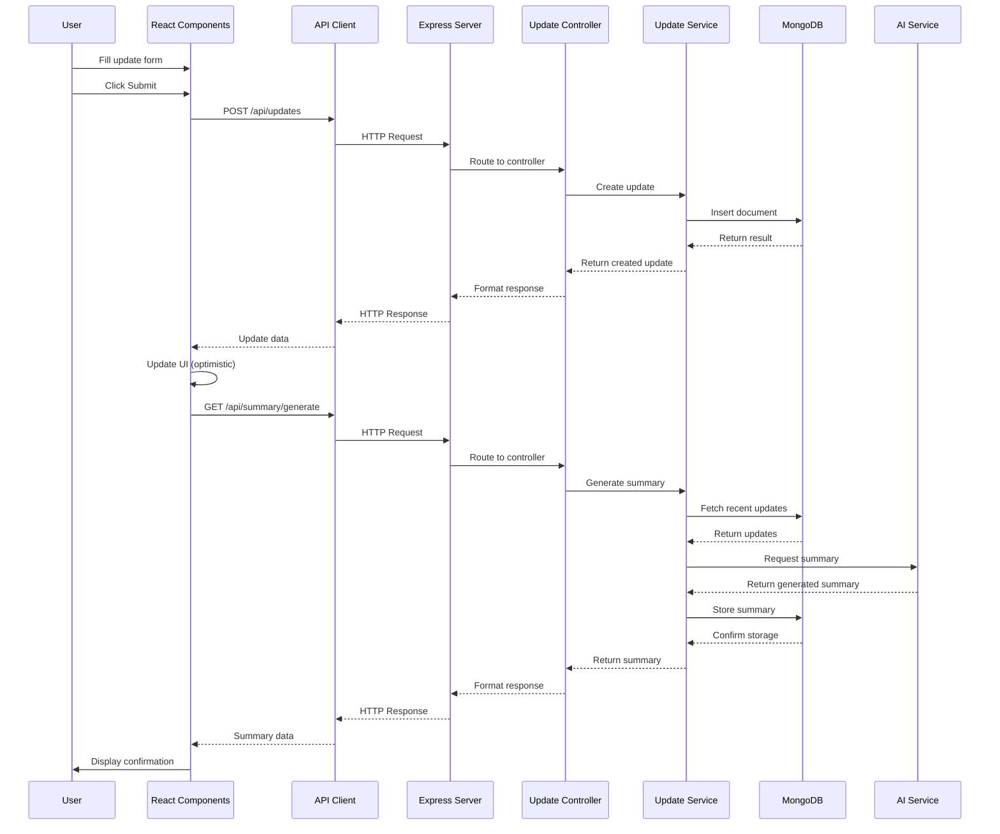

### 3.2 Search Updates Flow

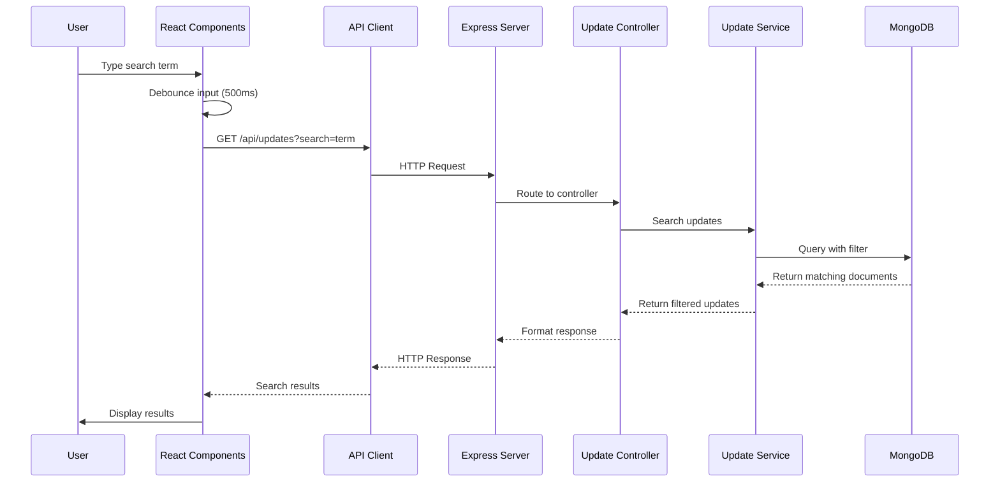

## 4. Component Interaction Patterns

### 4.1 Parent-Child Component Communication

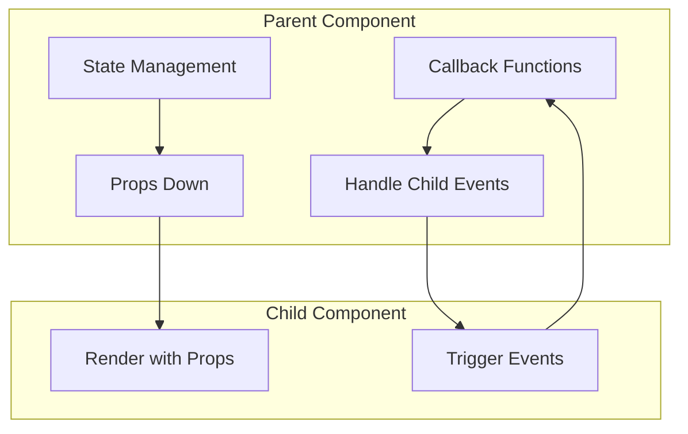

Smart Ping uses standard React patterns for component communication:

1. **Props Down**: Parent components pass data and callback functions to children
2. **Events Up**: Child components call parent-provided functions to communicate upward
3. **Composition**: Complex components are composed of simpler, reusable components

### 4.2 Frontend-Backend Communication

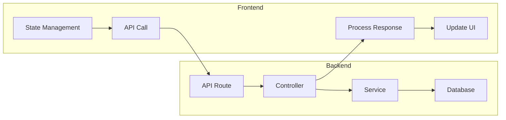

The application uses a RESTful API approach for frontend-backend communication:

1. **HTTP Methods**: GET, POST, PUT, DELETE for CRUD operations
2. **JSON Format**: Data exchange in JSON format
3. **Status Codes**: Standard HTTP status codes for response status
4. **Error Handling**: Consistent error response format

## 5. State Management

### 5.1 Frontend State Management

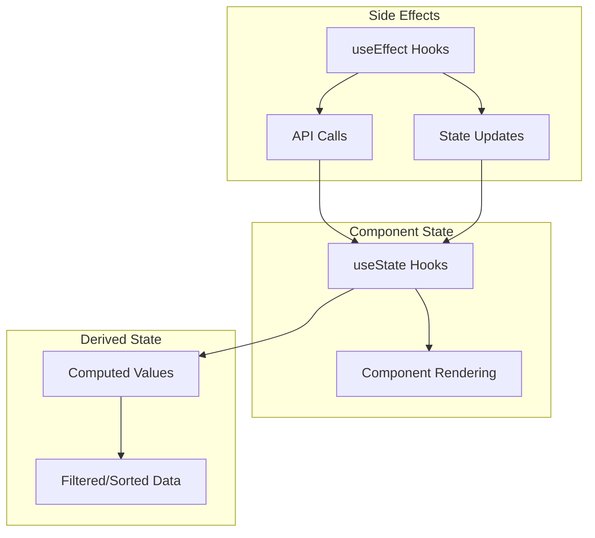

Smart Ping uses React's built-in state management with hooks:

1. **useState**: Local component state for UI elements and form data
2. **useEffect**: Side effects for API calls and data fetching
3. **useCallback**: Memoized callbacks for event handlers
4. **useMemo**: Memoized values for expensive computations

### 5.2 Backend State Management

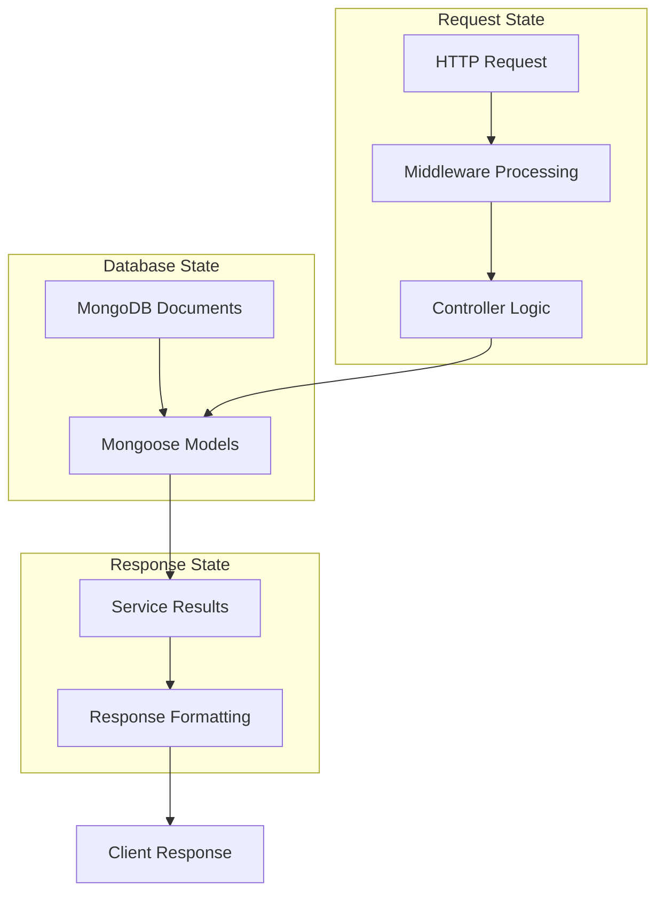

The backend manages state through:

1. **Database**: Persistent state in MongoDB
2. **Request Context**: State specific to the current request
3. **Service Layer**: Business logic and data transformation

## 6. Error Handling and Recovery

### 6.1 Frontend Error Handling

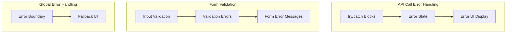

Smart Ping implements frontend error handling through:

1. **Try/Catch Blocks**: Around API calls and async operations
2. **Error States**: Dedicated state variables for error conditions
3. **User Feedback**: Clear error messages and recovery options

### 6.2 Backend Error Handling

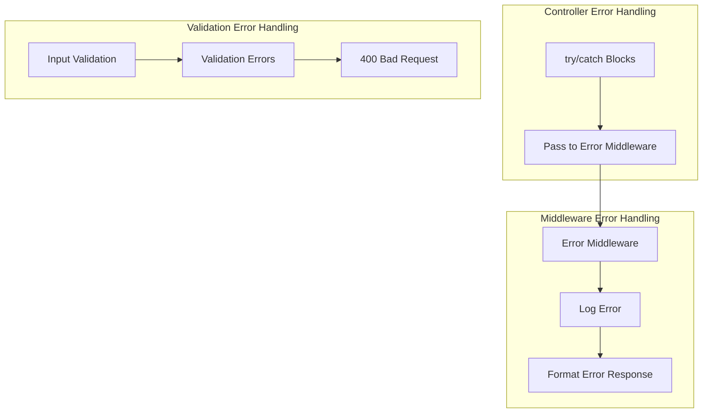

The backend handles errors through:

1. **Error Middleware**: Centralized error processing
2. **HTTP Status Codes**: Appropriate status codes for different errors
3. **Structured Error Responses**: Consistent error format

## 7. Cross-Cutting Concerns

### 7.1 Logging and Monitoring

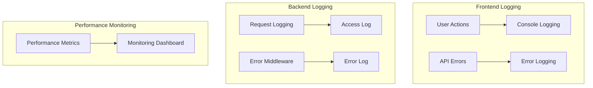

### 7.2 Security

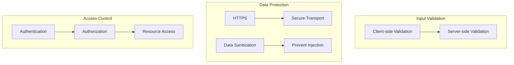

## 8. Component Dependencies

### 8.1 Frontend Dependencies

```mermaid
dependencyDiagram
    Layout --> Head
    Layout --> FaBell
    Layout --> FaGithub
    Layout --> FaQuestionCircle
    Layout --> FaTimes
    
    SearchBar --> FaSearch
    SearchBar --> FaTimes
    
    UpdateForm --> FaUser
    UpdateForm --> FaHeading
    UpdateForm --> FaEdit
    
    Button --> LoadingSpinner
    
    HomePage --> Layout
    HomePage --> SearchBar
    HomePage --> UpdateForm
    HomePage --> UpdateItem
    HomePage --> Button
```

### 8.2 Backend Dependencies

```mermaid
dependencyDiagram
    Server --> Express
    Server --> Mongoose
    Server --> Cors
    Server --> BodyParser
    
    UpdatesRoute --> Express.Router
    UpdatesRoute --> UpdateController
    
    SummaryRoute --> Express.Router
    SummaryRoute --> SummaryController
    
    UpdateController --> UpdateService
    SummaryController --> SummaryService
    
    UpdateService --> UpdateModel
    SummaryService --> SummaryModel
    SummaryService --> AIService
```

## 9. Deployment Architecture

### 9.1 Development Environment

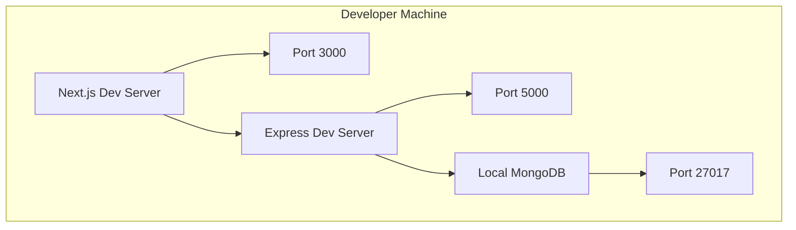

### 9.2 Production Environment

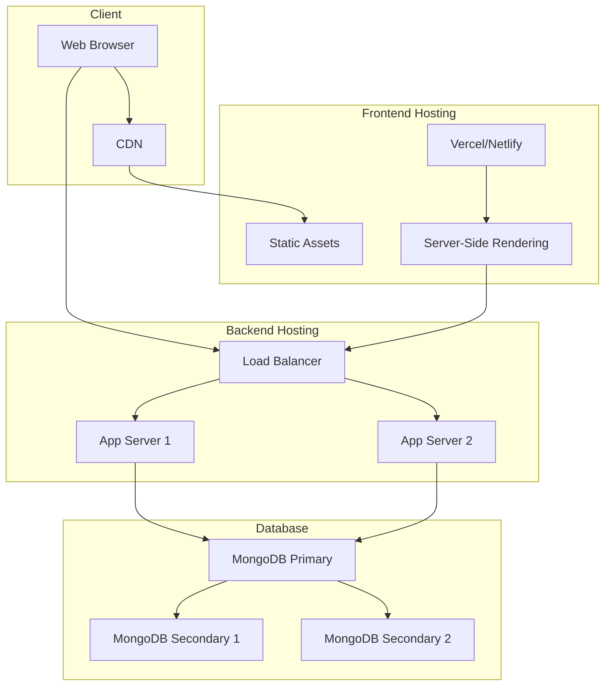

## 10. Architectural Decisions

### 10.1 Key Decisions

| Decision | Rationale | Alternatives Considered |
|----------|-----------|-------------------------|
| Next.js for Frontend | Server-side rendering, routing, API routes | Create React App, Gatsby |
| Express.js for Backend | Lightweight, flexible, middleware support | Koa, Fastify, NestJS |
| MongoDB for Database | Document-oriented, flexible schema | PostgreSQL, MySQL, Firebase |
| REST API for Communication | Simple, stateless, cacheable | GraphQL, WebSockets |
| React Hooks for State | Built-in, lightweight, component-scoped | Redux, MobX, Context API |
| Tailwind CSS for Styling | Utility-first, responsive, customizable | Styled Components, CSS Modules |

### 10.2 Trade-offs

| Trade-off | Benefit | Cost |
|-----------|---------|------|
| Monolithic Architecture | Simplicity, easier development | Limited scalability |
| No Authentication | Faster development, simpler UX | Security vulnerability |
| Client-side Search | Reduced server load | Limited search capabilities |
| No Real-time Updates | Simpler implementation | Manual refresh required |
| Basic Error Handling | Faster development | Limited error recovery |

## 11. Evolution and Extensibility

### 11.1 Extension Points

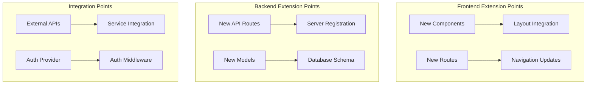

### 11.2 Architectural Evolution

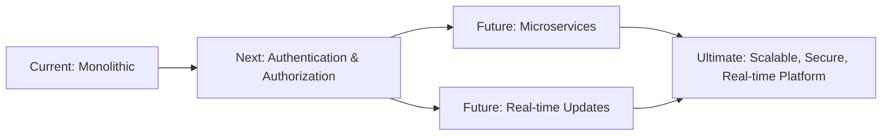

## 12. Conclusion

Smart Ping's architecture follows modern web development practices with a clear separation of concerns between frontend, backend, and data layers. The component-based design promotes reusability and maintainability, while the RESTful API approach ensures clear communication between client and server.

Key architectural strengths include:

1. **Modular Components**: Well-defined components with single responsibilities
2. **Clear Data Flow**: Predictable data flow between components and layers
3. **Separation of Concerns**: Clear boundaries between presentation, business logic, and data access
4. **Extensibility**: Designed for future enhancements and scaling

Areas for architectural improvement include:

1. **Authentication and Authorization**: Adding secure user management
2. **Real-time Capabilities**: Implementing WebSockets for instant updates
3. **Advanced State Management**: Considering more robust state management for scaling
4. **Microservices Evolution**: Planning for decomposition into specialized services

This architecture provides a solid foundation for the current requirements while allowing for future growth and enhancement as the application evolves.