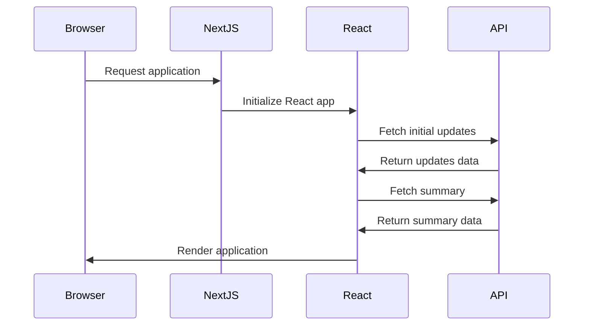
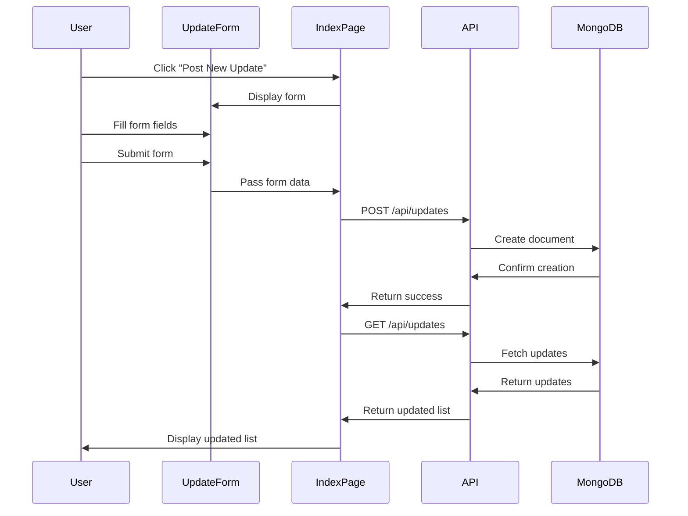
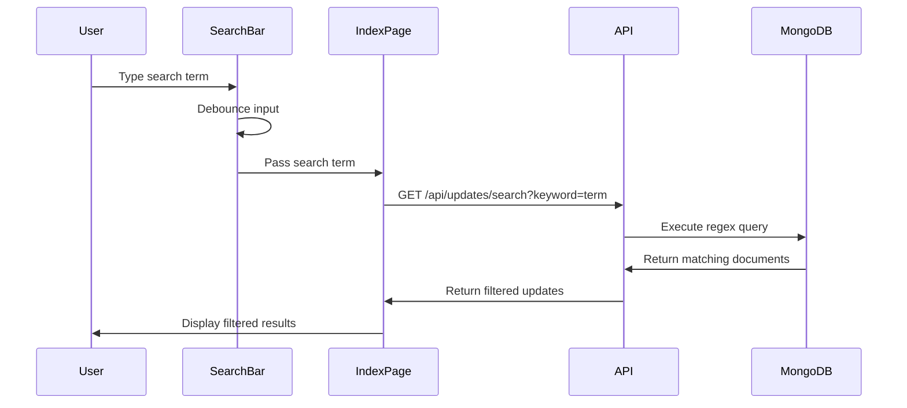
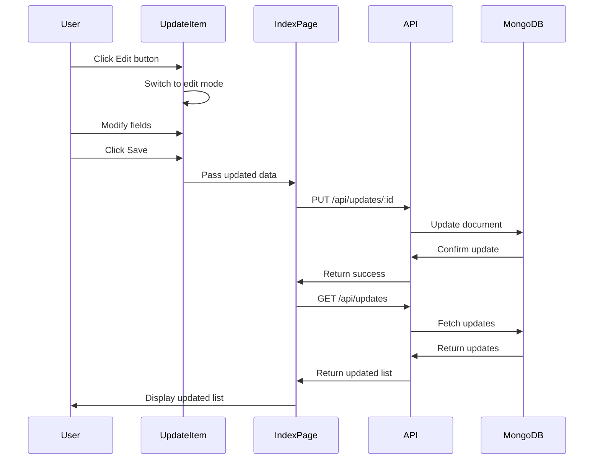
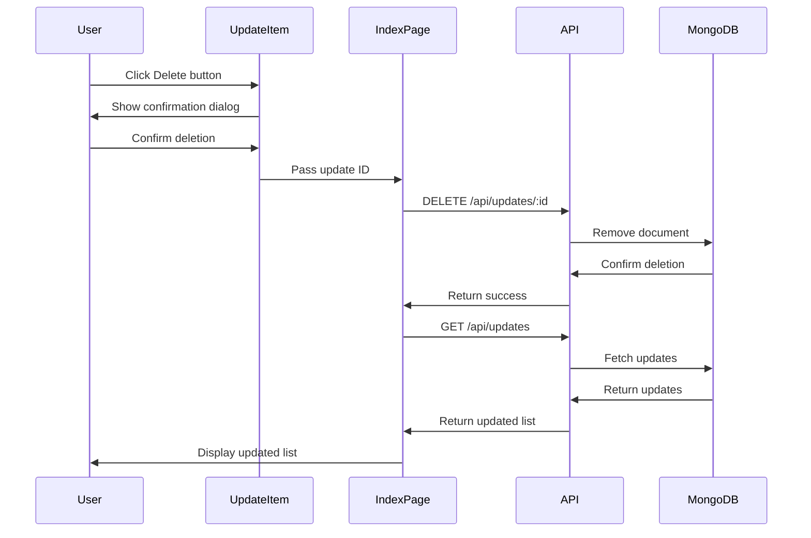
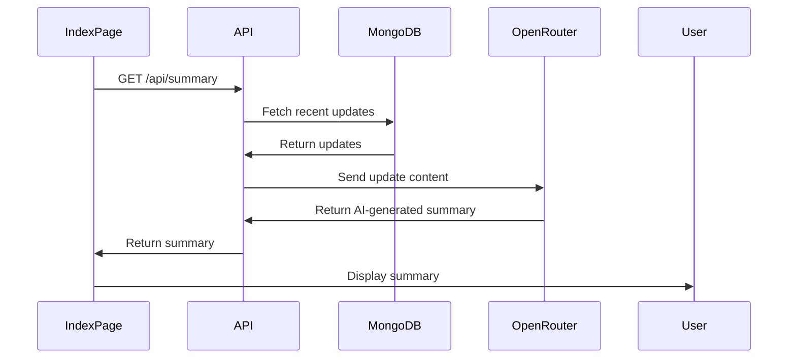
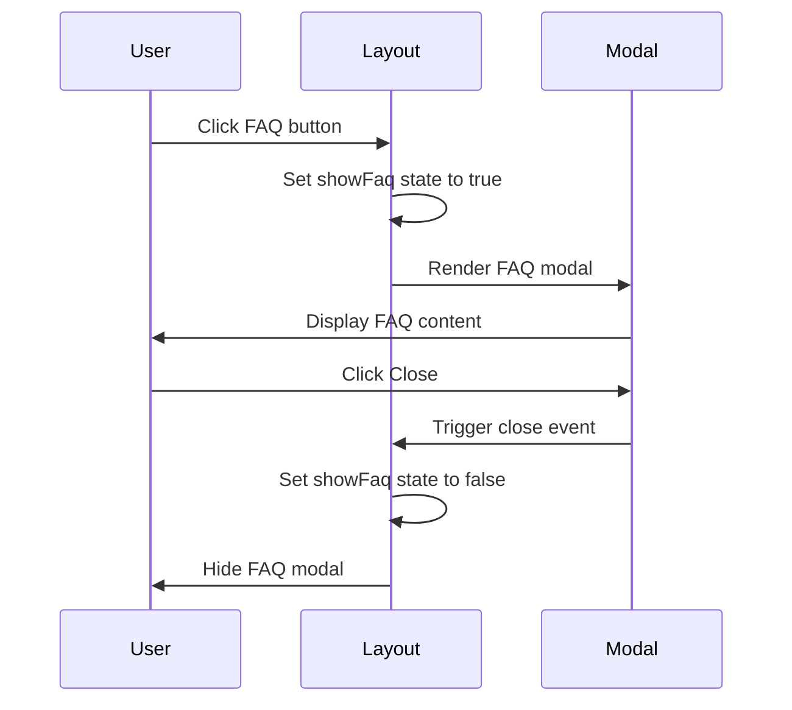

# Smart Ping: Flow of Execution

This document details the flow of execution within the Smart Ping application, illustrating how data and user interactions move through the system's components.

## 1. Application Initialization

### Frontend Initialization

**Detailed Steps:**

1. User navigates to the Smart Ping application URL
2. Next.js server receives the request and initializes the React application
3. The `index.tsx` page component mounts and executes its `useEffect` hook
4. Two API calls are made in parallel:
   - `GET /api/updates` to fetch all updates
   - `GET /api/summary` to fetch the AI-generated summary
5. The application renders with the fetched data

## 2. Creating an Update

**Detailed Steps:**

1. User clicks the "Post New Update" button, toggling the form visibility state
2. User fills in the form fields (name, title, content)
3. User submits the form, triggering the `handleSubmit` function
4. Form data is validated on the client side
5. A POST request is sent to `/api/updates` with the form data
6. The backend validates the input and creates a new document in MongoDB
7. On successful creation, the frontend:
   - Hides the form
   - Refreshes the updates list
   - Refreshes the summary

## 3. Searching Updates

**Detailed Steps:**

1. User types in the search bar
2. The `SearchBar` component:
   - Updates its local state
   - Debounces the input (waits 500ms for typing to stop)
   - Calls the parent's `onSearch` callback
3. The `handleSearch` function in `index.tsx` is triggered
4. If the search term is empty, it fetches all updates
5. Otherwise, it sends a GET request to `/api/updates/search?keyword=term`
6. The backend executes a case-insensitive regex search across title, content, and user fields
7. The frontend updates the updates state with the filtered results

## 4. Editing an Update

**Detailed Steps:**

1. User clicks the Edit button on an update
2. The `UpdateItem` component switches to edit mode, displaying form fields
3. User modifies the fields and clicks Save
4. The component validates the input and calls the `onEdit` callback
5. The `handleEdit` function in `index.tsx` sends a PUT request to `/api/updates/:id`
6. The backend validates the input and updates the document in MongoDB
7. On successful update, the frontend refreshes the updates list and summary

## 5. Deleting an Update

**Detailed Steps:**

1. User clicks the Delete button on an update
2. A confirmation dialog is displayed
3. User confirms the deletion
4. The `onDelete` callback is triggered with the update ID
5. The `handleDelete` function in `index.tsx` sends a DELETE request to `/api/updates/:id`
6. The backend removes the document from MongoDB
7. On successful deletion, the frontend refreshes the updates list and summary

## 6. Generating Summary

**Detailed Steps:**

1. The frontend requests a summary from `/api/summary`
2. The backend retrieves recent updates from MongoDB
3. The update content is formatted and sent to the OpenRouter API
4. The AI model generates a concise summary of the updates
5. The summary is returned to the frontend and displayed in the Summary section

## 7. Viewing FAQ

**Detailed Steps:**

1. User clicks the FAQ button in the navigation bar
2. The `Layout` component sets the `showFaq` state to true
3. The FAQ modal is rendered with information about Smart Ping
4. User reads the FAQ content
5. User clicks the Close button
6. The `Layout` component sets the `showFaq` state to false, hiding the modal

## Data Flow Summary

The Smart Ping application follows a typical React/Next.js frontend with Express backend architecture:

1. **Frontend State Management**:
   - React hooks (`useState`, `useEffect`) manage component state
   - State is passed down to child components as props
   - Child components communicate with parents via callback functions

2. **API Communication**:
   - Axios is used for HTTP requests between frontend and backend
   - RESTful API endpoints follow standard CRUD operations
   - JSON is used for data exchange

3. **Backend Processing**:
   - Express routes handle API requests
   - Mongoose models interact with MongoDB
   - OpenRouter API is used for AI summary generation

4. **Data Persistence**:
   - MongoDB stores update documents
   - Updates include user, title, content, and timestamp fields

This flow of execution demonstrates how Smart Ping maintains a clean separation of concerns while providing a responsive and intuitive user experience.